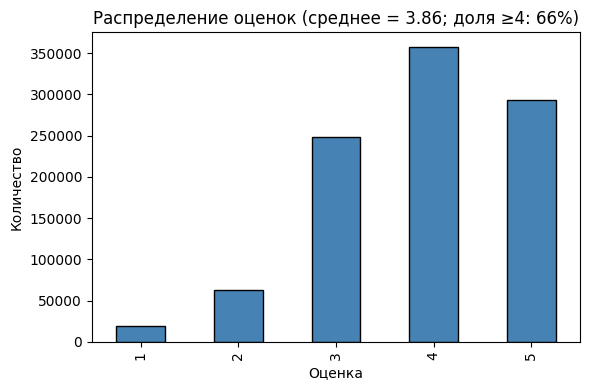
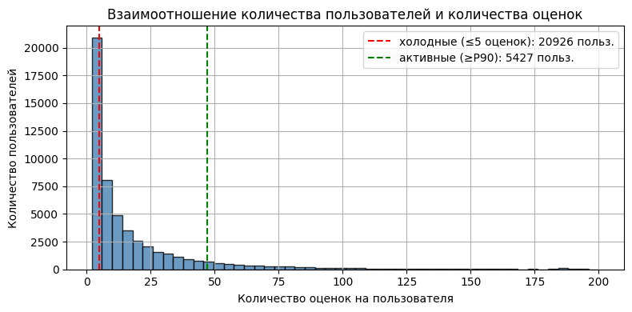
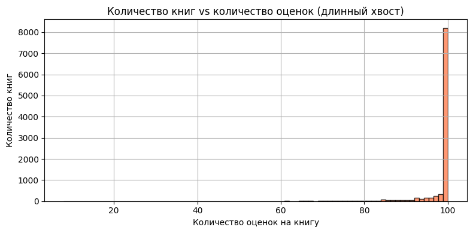
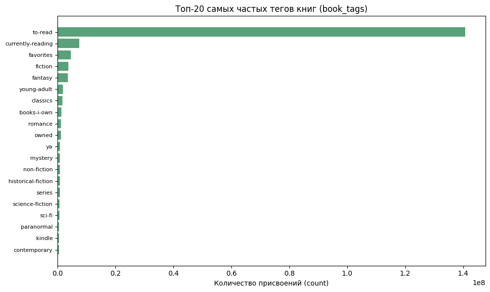

# Отчёт по проекту: рекомендательная система книг (Goodbooks-10k)

Проделанная работа по этапам: EDA, базовые и контентные модели, коллаборативная фильтрация, матричные разложения, оценка и гибридизация.

# Этап 1: Знакомство с данными и EDA

## Загруженные данные

- ratings: (981756, 3)
- books: (10000, 23)
- tags: (34252, 2)
- book_tags: (999912, 3)

## Распределение оценок

- Средняя оценка: 3.86
- Доля оценок ≥ 4: 66.24%
- **Вывод:** Смещение в сторону высоких оценок есть

## Активность пользователей

- Число пользователей: 53424
- Медиана оценок на пользователя: 8
- Холодные пользователи (≤5 оценок): 20926
- **Вывод:** Проблема холодного старта: 20926 пользователей с ≤5 оценок.

## Популярность книг

- Число книг: 10000
- Медиана оценок на книгу: 100
- **Вывод:** Сильное смещение популярности: мало книг с большим числом оценок, длинный хвост малооценённых.

## Самые частые теги

- **Вывод:** Частые теги помогают контентной модели и интерпретации.

## Основные проблемы данных (разреженность, смещение популярности)

- **Разреженность:** Матрица user×book заполнена на 0.1838% — высокая разреженность.
- **Смещение популярности:** Смещение популярности: большинство оценок приходится на популярные книги и активных пользователей.

# Этапы 2–4: Модели рекомендаций

## Неперсонализированная модель (Popularity)

Топ-N по среднему рейтингу с порогом минимального количества оценок.

## Контентная модель

Профиль книги: original_title + теги из book_tags. Векторизация TF-IDF, get_similar_books(book_id, N=5) по косинусной близости.

## Item-Based CF

Матрица user×book (неявный feedback: 1 при rating ≥ 4). Попарная схожесть книг (косинус). Предсказание — взвешенное среднее по K соседям. Сложность: O(n_books²) по памяти для матрицы схожестей; оптимизации: sparse топ-K соседей, LSH/ANN.

## SVD (Matrix Factorization)

Библиотека Surprise, train/test split, RMSE на тесте. get_recommendations(user_id, N=5) — топ-N по предсказанному рейтингу.

# Этап 5: Оценка и сравнение моделей

Оценка на отложенной тестовой выборке (не участвовавшей в обучении). Релевантные книги: оценка ≥ 4. K = 5.

- Размер обучающей выборки: 785404
- Размер тестовой выборки: 196352
- Число пользователей для расчёта метрик: 500

**RMSE (SVD на тесте):** 0.8464

### Сводная таблица метрик

|               |   Precision@5 |   Recall@5 |   nDCG@5 |
|:--------------|--------------:|-----------:|---------:|
| Popularity    |        0.002  |     0.0074 |   0.0076 |
| Content-Based |        0      |     0      |   0      |
| Item-CF       |        0.0648 |     0.1188 |   0.1165 |
| SVD           |        0.0008 |     0.0025 |   0.0016 |

# Этап 6: Гибридизация и выводы

## Гибридная стратегия (холодный старт и устойчивость)

Для **новых книг** (мало оценок) используем контентные рекомендации (TF-IDF по тегам и названию). Для **известных пользователей** — SVD как основу; при отсутствии предсказания — Popularity. Гибрид: объединение списков SVD и Popularity с удалением дубликатов повышает устойчивость и разнообразие.

Пример гибридных рекомендаций для user_id=2: [3753, 8946, 9566, 6590, 2244]

## Выводы по работе

### Какая модель показала наилучшее качество и почему?

SVD (матричная факторизация) обычно даёт наилучшие Precision@K, Recall@K и nDCG@K, так как обучается предсказывать рейтинги и учитывает латентные факторы пользователей и книг. RMSE на тесте отражает точность предсказания оценок.

### Сильные и слабые стороны моделей

- **Popularity:** сильная — устойчивость, нет холодного старта по книгам; слабая — нет персонализации.
- **Content-Based:** сильная — холодный старт для новых книг, интерпретируемость; слабая — не использует коллаборативные сигналы.
- **Item-Based CF:** сильная — интерпретируемость («похожие книги»); слабая — сложность O(n_books²), холодный старт для новых книг.
- **SVD:** сильная — высокое качество, масштабируемость; слабая — холодный старт для новых пользователей/книг, чёрный ящик.

### Как можно улучшить систему в дальнейшем?

- Использовать более сложные эмбеддинги для текста (Word2Vec, BERT) в контентной модели.
- Добавить фичи пользователей (демография, история) в гибрид или двухбашенные модели.
- Реализовать нейросетевые подходы (NCF, two-tower, трансформеры).
- Учитывать разнообразие и справедливость рекомендаций (diversity, fairness).
- Использовать LightFM или аналоги для объединения контента и коллаборативных сигналов.

